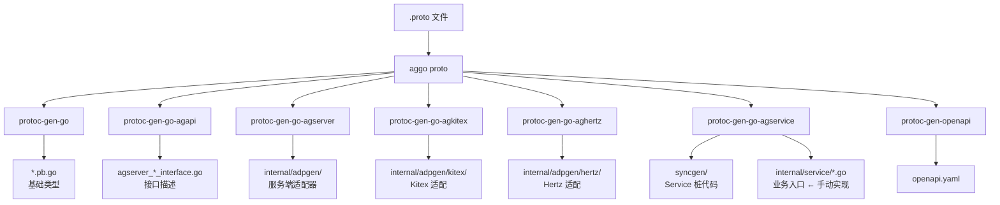

---
tags:
  - ag-core
  - codegen
  - protobuf
  - aggo
  - protoc
  - workflow
---

# Protobuf 生成流程

> 路径：`tool/cmd/aggo/internal/cmd_proto/` + `tool/cmd/protoc-gen-go-*/` + `tool/aggen/` | 从 `.proto` 到全套微服务代码

关于代码生成的架构设计、proto 解析、类型系统和模板渲染，详见：[01-代码生成引擎架构](01-代码生成引擎架构.md)。
关于 proto 文件编写规范、`google.api.http` 注解用法、查询参数映射规则，详见：[02-ProtoIDL规范](02-ProtoIDL规范.md)。

## 概述

`aggo proto` 是一个 `protoc` 包装器，调用 7 个 protoc 插件（含标准 `protoc-gen-go`）完成从 `.proto` 定义文件到 Go 微服务代码的完整生成。

```
.proto 文件
    │
    ▼
aggo proto [-p plugin] [-m model] [-e proto_path] <file>
    │
    ├── 收集 proto 文件（递归目录）
    ├── 选择插件（-p all 默认全部）
    ├── 选择模式（-m server / client / all）
    └── 执行 protoc 命令
          │
          ▼
    protoc 调用 7 个插件：
    ├── protoc-gen-go              → *.pb.go（protobuf 基础代码）
    ├── protoc-gen-go-agapi        → 接口描述文件
    ├── protoc-gen-go-agserver     → 服务端 adapter 代码
    ├── protoc-gen-go-agservice    → 业务 service 桩代码
    ├── protoc-gen-go-agkitex      → Kitex RPC 适配代码
    ├── protoc-gen-go-aghertz      → Hertz HTTP 适配代码
    └── protoc-gen-openapi         → OpenAPI 规范文档
```

## aggo proto 命令

`aggo proto` 是一个 **protoc 包装器**，统一管理 7 个 protoc 插件完成从 `.proto` 到全套微服务代码的自动化生成。

调用流程：

```
aggo proto -p <plugins> -m <model> -e <proto-path> <idl-file-or-dir>
    │
    ├── initProtos()     → 查找 proto 文件（递归目录）
    ├── initPlugins()    → 解析 -p 参数
    ├── initModels()     → 解析 -m 参数
    ├── initExtPlugins() → 解析 -P 参数（透传 protoc 额外参数）
    ├── selectPlugins()  → 按 -p + -m 筛选插件 → 生成 protoc flags
    └── protoc <flags> <protos>
```

```bash
# 完整命令格式
aggo proto -p <plugin> -m <model> -e <proto-path> <idl-file-or-dir>

# 示例

# 1. 一步生成全部（默认 -p all -m all）
aggo proto -e ./idl/api ./idl/api/student/student.proto

# 2. 仅生成服务端代码（过滤 kitex/client、hertz/client）
aggo proto -p all -m server -e ./idl/api ./idl/api/student/student.proto

# 3. 仅生成客户端适配代码
aggo proto -p kitex,hertz -m client -e ./idl/api ./idl/api/student/student.proto

# 4. 指定特定基础插件（go/api/server 注册为 base，不受 -m 影响）
aggo proto -p go,api,server -e ./idl/api ./idl/api/student/student.proto
```

### 参数

| 参数 | 缩写 | 说明 | 默认值 |
|------|------|------|--------|
| `--plugins` | `-p` | 插件名，逗号分隔或指定多次 | `all` |
| `--models` | `-m` | 生成模式：`server` / `client` / `all`（⚠️ 仅对部分插件有效，详见下方说明） | `all` |
| `--ext-proto-path` | `-e` | 外部 proto 路径（导入搜索路径） | 空 |
| `--ext-plugins` | `-P` | 额外 protoc 参数透传 | 空 |
| `--desc` | `-d` | 只打印命令不执行 | false |

### 插件注册表

定义在 `plugins_init.go`：

```go
// go 基础代码
RegPlugin("go",   "base",   "--go_out=paths=source_relative:./api")

// API 接口描述
RegPlugin("api",  "base",   "--go-agapi_out=.")

// 服务端适配
RegPlugin("server", "base", "--go-agserver_out=model=xxx:.")

// 业务 service
RegPlugin("service", "server", "--go-agservice_out=.")

// Kitex（服务端 + 客户端）
RegPlugin("kitex", "server", "--go-agkitex_out=model=server:.")
RegPlugin("kitex", "client", "--go-agkitex_out=model=client:.")

// Hertz（服务端 + 客户端）
RegPlugin("hertz", "server", "--go-aghertz_out=model=server:.")
RegPlugin("hertz", "client", "--go-aghertz_out=model=client:.")

// OpenAPI
RegPlugin("openapi", "base", "--openapi_out=fq_schema_naming=true,...:.")
```

`-p all` 等效于同时指定所有插件。

### -m 参数的实际作用范围

`-m` 参数在 `selectPlugins()` 阶段过滤插件，过滤逻辑为：

```go
if modelAll || m == ModelBase || lo.Contains(models, m) {
    pgs = append(pgs, mps[m]...)
}
```

因为 `m == ModelBase` 的条件，所有注册为 `"base"` 的插件变体都会“无条件执行”，`-m` 根本拦不住。

| 插件 | 注册 model | `-m` 能过滤？ |
|------|-------------------|:----------------:|
| `go` | `"base"` | ❌ 总会生成 `api/*.pb.go` |
| `api` | `"base"` | ❌ 总会生成 `*_interface.go` |
| `server` | `"base"` | ❌ 总会生成（传 `model=xxx` 占位） |
| `openapi` | `"base"` | ❌ 总会生成 |
| `service` | `"server"` | ✅ `-m server` 或 `-m all` |
| `kitex` | `"server"` + `"client"` | ✅ 可分别控制 server/client |
| `hertz` | `"server"` + `"client"` | ✅ 可分别控制 server/client |

实际效果：
- `-m server` → 生成 `service` + `kitex/server` + `hertz/server`
- `-m client` → 生成 `kitex/client` + `hertz/client`
- `go`/`api`/`server`/`openapi` → 始终生成，`-m` 无效


### 执行流程

```
aggo proto -p go,api -m server -e ./idl/api ./idl/api/student/student.proto
    │
    ├── findProtos → ["./idl/api/student/student.proto"]
    ├── initPlugins → ["go", "api"]
    ├── initModels → ["server"]
    │
    ├── selectPlugins(["go", "api"], ["server"])
    │     ├── base → "--go_out=paths=source_relative:./api"
    │     ├── go.base → "--go_out=paths=source_relative:./api"
    │     └── api.base → "--go-agapi_out=."
    │
    └── protoc \
          --proto_path=./idl/api \
          --proto_path=./third_party \
          --go_out=paths=source_relative:./api \
          --go-agapi_out=. \
          ./idl/api/student/student.proto
```

## 七种插件详解

### 1. protoc-gen-go — 基础类型代码

**标准 protobuf Go 插件**。输出 `*.pb.go` 文件，包含：

- 消息类型的 Go struct
- Marshal/Unmarshal 方法
- 服务接口定义

**输出目录**：`./api/<package>/<file>.pb.go`

**命令示例**：
```bash
aggo proto -p go -m server -e ./idl/api ./idl/api/student/student.proto
# 生成：api/student/student.pb.go
```

### 2. protoc-gen-go-agapi — 服务接口描述

**生成 `agserver_*_interface.go`**，描述 proto 定义的服务接口，包括：

- 每个 RPC 方法的入参/出参类型
- HTTP 路由映射（如果 proto 中有 google.api.http 注解）
- 服务级别的元信息

**输出示例**：`api/student/agserver_student_interface.go`

```bash
aggo proto -p api -m server -e ./idl/api ./idl/api/student/student.proto
```

### 3. protoc-gen-go-agserver — 服务端适配器

**生成服务器初始化和适配代码**：

- `internal/adpgen/zfx_adapter.go` — FX 适配器模块注册
- `internal/adpgen/adpinit/zfx_adapter_init.go` — 适配器初始化入口

```bash
aggo proto -p server -m server -e ./idl/api ./idl/api/student/student.proto
```

### 4. protoc-gen-go-agkitex — Kitex 适配

**服务端模式**（`-m server`）：

| 生成文件 | 说明 |
|---------|------|
| `internal/adpgen/kitex/<svc>/agkitex_<svc>_server.go` | Kitex 服务端 Handler（调用业务层） |
| `internal/adpgen/kitex/<svc>/agkitex_<svc>_fx.go` | Kitex 服务端 FX 模块 |
| `internal/adpgen/adpinit/zfx_agkitex_<pkg>_<svc>_adpinit.go` | Kitex 适配初始化 |

**客户端模式**（`-m client`）：

| 生成文件 | 说明 |
|---------|------|
| `internal/adpgen/kitex/<svc>/agkitex_<svc>.go` | Kitex 客户端类型定义 |
| `internal/adpgen/kitex/<svc>/agkitex_<svc>_client.go` | Kitex 客户端实现 |
| `internal/adpgen/kitex/<svc>/agkitex_<svc>_agclient.go` | AgService 封装客户端 |

```bash
# 服务端
aggo proto -p kitex -m server -e ./idl/api ./idl/api/student/student.proto

# 客户端
aggo proto -p kitex -m client -e ./idl/api ./idl/api/student/student.proto
```

### 5. protoc-gen-go-aghertz — Hertz 适配

**服务端模式**（`-m server`）：

| 生成文件 | 说明 |
|---------|------|
| `internal/adpgen/hertz/<svc>/aghertz_<svc>_server.go` | Hertz 服务端 Handler |
| `internal/adpgen/hertz/<svc>/aghertz_<svc>_fx.go` | Hertz 服务端 FX 模块 |
| `internal/adpgen/adpinit/zfx_aghertz_<pkg>_<svc>_adpinit.go` | Hertz 适配初始化 |

**客户端模式**（`-m client`）：

| 生成文件 | 说明 |
|---------|------|
| `internal/adpgen/hertz/<svc>/aghertz_<svc>_client.go` | Hertz 客户端 |

```bash
# 服务端
aggo proto -p hertz -m server -e ./idl/api ./idl/api/student/student.proto

# 客户端
aggo proto -p hertz -m client -e ./idl/api ./idl/api/student/student.proto
```

### 6. protoc-gen-go-agservice — 业务 Service 桩代码

**生成业务层的 Service 桩代码**（`-m server` 模式）：

| 生成文件 | 说明 |
|---------|------|
| `internal/svcgen/zfx_service.go` | Service 层 FX 模块注册 |
| `internal/svcgen/zfx_agservice_proxy_<pkg>.go` | AgService Proxy 的 FX 注入 |
| `internal/svcgen/agservice_<svc>_proxy.go` | Service Proxy 实现 |
| `internal/service/agservice_<svc>.go` | **业务入口模板**（不会被覆盖！） |

关键设计：`internal/service/agservice_<svc>.go` 是**业务代码入口**，后续再次运行 `aggo proto` 不会覆盖此文件。开发者在此文件中实现业务逻辑（调用 DAO、其他微服务等）。

```bash
aggo proto -p service -m server -e ./idl/api ./idl/api/student/student.proto
```

### 7. protoc-gen-openapi — OpenAPI 规范

基于 `google.api.http` 注解生成 OpenAPI 3.0 规范文档。

```bash
aggo proto -p openapi -e ./idl/api ./idl/api/student/student.proto
```

## 完整生成流程（从 proto 到运行）

```
步骤 1: aggo proto -p go      → api/<pkg>/<file>.pb.go          (基础类型)
步骤 2: aggo proto -p api     → api/<pkg>/agserver_<svc>_interface.go  (接口描述)
步骤 3: aggo proto -p server  → internal/adpgen/zfx_adapter.go  (服务端适配器)
                                internal/adpgen/adpinit/
步骤 4: aggo proto -p kitex   → internal/adpgen/kitex/<svc>/   (Kitex 适配)
步骤 5: aggo proto -p hertz   → internal/adpgen/hertz/<svc>/   (Hertz 适配)
步骤 6: aggo proto -p service → internal/svcgen/               (Service 桩)
                                internal/service/<file>.go      (业务入口 ← 写代码)
步骤 7: 实现 internal/service/<file>.go 中的业务逻辑
步骤 8: cd cmd/server && go build && ./server
```

```
项目目录结构：
├── api/<pkg>/                     ← 步骤 1-2：pb.go + 接口
├── idl/api/<pkg>/                 ← 输入：.proto 文件
├── internal/
│   ├── adpgen/                    ← 步骤 3-5：协议适配层
│   │   ├── adpinit/               ← FX 初始化
│   │   ├── hertz/<svc>/           ← Hertz 服务端/客户端
│   │   ├── kitex/<svc>/           ← Kitex 服务端/客户端
│   │   └── zfx_adapter.go
│   ├── svcgen/                    ← 步骤 6：Service 桩代码
│   ├── service/                   ← 步骤 6：业务逻辑（手动实现）
│   └── init.go
├── cmd/server/
│   ├── main.go
│   └── app.yml
└── third_party/                   ← proto 依赖
```

## 流程图


