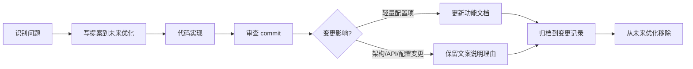

---
tags:
  - ag-core
  - process
  - optimization
---

# 优化管理流程

> 如何管理从「发现优化机会」到「审查归档」的完整闭环。

## 流程



## 目录结构

```
演进管理/
├── 00-概述与流程.md               # 流程说明（本文）
├── ROADMAP.md                     # 演进路线图（近期/中期/远期排期）
├── 技术评估/                       # 方案对比与分析
├── 待办优化/                       # 待解决的问题提案
│   ├── App生命周期钩子.md
│   └── AgCrypto加密模块.md
└── 变更记录/                       # 已实现的变更（闭环归档）
    └── Log归档LocalTime.md
```

## 提案模板

每篇提案统一使用以下 frontmatter：

```yaml
---
title: "提案标题"
status: 待解决           # 待解决 | 评估中 | 已实现 | 已废弃
proposed: 2026-06-10   # 提出日期
implemented:            # 实现日期（完成后补充）
commit:                 # 关联 commit hash（完成后补充）
---
```

## 归档规则

| 变更类型 | 归档方式 |
|----------|---------|
| 配置项新增（如 local_time） | 提案归档到变更记录，配置说明写进功能文档，提案不留档 |
| API/接口变更 | 提案归档到变更记录，功能文档更新使用指南 |
| 架构级重构 | 提案归档到变更记录，技术评估对比方案，功能文档更新设计说明 |
| 纯 bug fix | 直接提交，无需提案 |

## 审查 commit 时的文档更新动作

每次审查 commit 后，对照以下清单：

- [ ] 是否有新的配置项/API → 更新功能文档
- [ ] 是否有旧模块删除 → 更新索引和概览
- [ ] 是否有待办优化提案涉及该变更 → 归档
- [ ] 是否有生成代码的引用路径变更 → 更新生成文档
